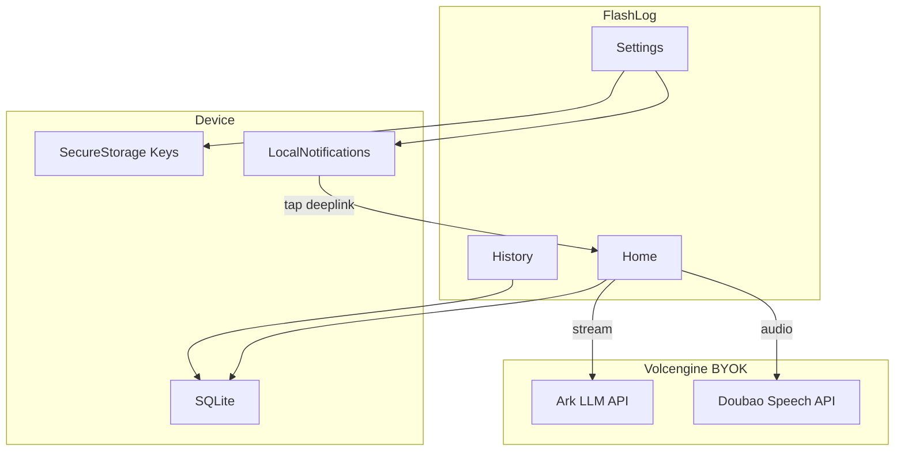
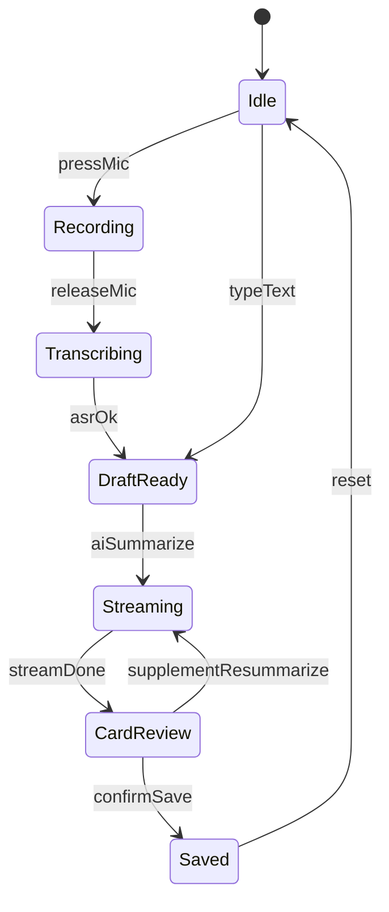

# FlashLog — 产品需求文档（PRD）

> AI 智能工时记录 App · 本地优先 · BYOK · 无后端

---

## 1. 产品愿景与原则

FlashLog 是一款纯单机、无后端转发的移动端应用：用户通过文字或语音描述工作内容，由大模型提炼为一张标准「工时卡片」并保存在本机。所有工时数据留在用户手机；所有 LLM、语音识别请求由 App **直连用户自行配置的云服务商**（默认火山引擎），不经任何第三方服务器转发。

**三条原则**

| 原则 | 说明 |
|------|------|
| **Local-First** | 工时记录仅存本机 SQLite，支持离线查看与手动录入 |
| **BYOK** | 用户自带 API Key；费用由用户承担，Settings 中明确提示 |
| **No Backend** | 不做账号、云同步、团队空间、API 代理 |

---

## 2. 目标用户与典型场景

**目标用户**：需要每日/每周汇总工时、又不想把工作内容上传到 SaaS 平台的职场人士（开发、产品、设计等）。

**典型场景**

1. 每天 18:00 收到本地提醒 → 打开 App 进入【工作记录】
2. 按住麦克风口述 1~3 分钟（或打字）→ 火山 ASR 转文字
3. 点击「AI 总结」→ 流式展示 → 生成 **一张** 工时卡片
4. 微调后「确认保存」→ 【历史】按日查看；需要时「复制今日」发给 leader

**口述补记昨天**：用户说「昨天花了半天做需求评审…」→ LLM 将卡片 `date` 解析为昨天；用户可在保存前手动改日期。

---

## 3. 平台与范围

| 项目 | 说明 |
|------|------|
| **首期平台** | iOS + Android（**Capacitor** 壳 + Vite React SPA） |
| **交付形态** | **Android 必达**：可安装的 debug APK 或签名 release APK / AAB；iOS 可同期或后续排期 |
| **默认服务商** | 火山引擎：方舟（LLM）+ 豆包语音（ASR） |
| **交互模型** | 一次输入 → 一次 AI 总结 → **一张** 卡片 → 一次保存 **一条** 记录 |

**明确不做（首期）**

- 用户账号与登录
- 云端备份 / 多设备同步
- 团队共享、审批流
- 服务端代理或中转 API

---

## 4. 信息架构

底部三 Tab（或等效路由）：

| Tab | 页面 | 职责 |
|-----|------|------|
| 工作记录 | Home | 输入、语音、AI 总结、卡片编辑、保存 |
| 历史 | History | 按日查看、编辑/删除、复制今日 |
| 设置 | Settings | 火山 LLM/ASR、提醒、数据清除 |

**首启引导**：未配置 LLM API Key 时，Home 禁用「AI 总结」，提示跳转 Settings；仍允许纯手动填写卡片并保存。



---

## 5. 功能规格

### 5.1 设置页（Settings）— 优先实现

#### 5.1.1 LLM（默认：火山方舟）

出厂预填，用户填入自己的凭证即可使用；支持「恢复火山默认」。

| 字段 | 默认值 / 说明 |
|------|----------------|
| API Base URL | `https://ark.cn-beijing.volces.com/api/v3`（OpenAI 兼容） |
| API Key | 脱敏输入；仅存 Secure Storage |
| Model / Endpoint ID | **必填**。请求体 `model` 可填其一：推理接入点 ID `ep-xxxxxxxx`（在[火山方舟控制台](https://console.volcengine.com/ark)创建）；或已开通的模型名，如 `doubao-1-5-pro-32k-250115` |
| System Prompt | 见 [§7 AI 契约](#7-ai-契约)；可编辑，支持「恢复默认」 |

可选（V1.1）：「连接测试」按钮，发送最小 completion 校验 Key 与 Model/Endpoint。

#### 5.1.2 ASR（默认：火山豆包语音）

| 字段 | 说明 |
|------|------|
| 服务商预设 | 「火山引擎」（默认选中） |
| API Key | **新版控制台**：单 Key（对应 WebSocket 头 `X-Api-Key`），脱敏存储 |
| App ID + Access Token | **旧版控制台**：分别填写（对应 `X-Api-App-Key` / `X-Api-Access-Key`） |
| Resource ID | **必填（V1.1 流式）**。如 `volc.bigasr.sauc.duration`、`volc.seedasr.sauc.duration`（对应 `X-Api-Resource-Id`） |
| Cluster | **旧版控制台**字段（如 `volcengine_input_common`）；新接入优先 Resource ID |
| 其他 | MVP：**录音结束后 HTTP 识别**（以控制台当前 HTTP 文档为准）；V1.1：**大模型流式** WebSocket 边录边出字 |

高级用户可切换「其他兼容接口」（如 OpenAI Whisper 格式：Base URL + Key + Model），系统原生语音识别为 **V1.1**。

参考文档：[大模型流式语音识别 API](https://www.volcengine.com/docs/6561/1354869?lang=zh)（V1.1 WebSocket） · [火山方舟 OpenAI 兼容](https://www.volcengine.com/docs/82379/1330626)

#### 5.1.3 定时提醒（V1.1，MVP 可预留 UI）

- 开关 + 时间选择（默认每天 18:00）
- 首次开启请求**通知权限**
- 点击通知：深链至 Home，聚焦输入框

#### 5.1.4 其他

- 「清除所有本地数据」（工时 + 草稿，不自动清除 Key，需二次确认）
- 说明文案：API 调用费用由用户自行承担

**验收标准（Settings）**

- [ ] 未填 LLM Key 时，Home「AI 总结」不可用并引导至 Settings
- [ ] API Key 在 UI 脱敏，重启 App 后仍可从 Secure Storage 读取
- [ ] 「恢复火山默认」可还原 Base URL 与 System Prompt
- [ ] ASR、LLM 配置项独立保存，互不影响

---

### 5.2 工作记录页（Home）

#### 布局

- 顶部可选展示当前 **`referenceDate`（今天）**，提示「默认记录今天，口述可指定其他日期」
- 大文本输入框（草稿）
- 底部：**麦克风**（录音）| **AI 总结** | （卡片出现后）**确认保存**
- 卡片预览区：任务名称、预估工时、归属日期、描述（均可编辑）
- 「补充说明」输入框（卡片出现后显示）

#### 核心规则：一次一条

| 规则 | 说明 |
|------|------|
| 单次总结 | 每次点击「AI 总结」只生成 **一张** 预览卡片 |
| 单次保存 | 「确认保存」只写入 **一条** `WorkLogItem` |
| 同日多条 | 同一天可多次保存，History 中该日显示多条卡片 |
| 补充说明 | 追加文字后再次「AI 总结」→ **合并覆盖**当前预览卡片，不并排多张；再次保存才落库 |

#### AI 交互流程

1. 用户打字和/或录音 → ASR 转写填入输入框
2. 点击「AI 总结」→ App 将 `referenceDate`（本地今天 `YYYY-MM-DD`）与原文一并送 LLM
3. **流式（Stream）** 输出，打字机效果展示
4. 流结束 → 解析 JSON → 切换为可编辑卡片
5. 用户编辑 / 补充说明 / 重新总结 → 「确认保存」→ 写入 SQLite，清空输入与预览

#### 交互状态机



#### 状态与按钮

| 状态 | 麦克风 | AI 总结 | 确认保存 |
|------|--------|---------|----------|
| Idle / DraftReady | 可用 | 有内容且已配置 LLM 时可用 | 隐藏 |
| Recording / Transcribing | Loading | 禁用 | 隐藏 |
| Streaming | 禁用 | Loading | 隐藏 |
| CardReview | 可用 | 可用（重新总结） | 可用 |
| 未配置 LLM | 可用（仅转写） | 禁用 + Toast 去 Settings | 可手动填卡片后保存 |

#### 错误与边界

| 情况 | 行为 |
|------|------|
| 无网络 | AI/ASR 不可用；提示网络错误；草稿保留；允许手动填卡片保存 |
| LLM 流中断 / 超时（如 15s 无首 token） | 提示重试；保留输入草稿 |
| JSON 解析失败 | 展示原始流文本；提供「重试」「手动编辑卡片」 |
| 录音过长 | 建议上限 3 分钟，超出前提示 |
| 麦克风无权限 | 引导至系统设置 |

**验收标准（Home）**

- [ ] 流式总结过程有打字机效果，结束后呈现单张可编辑卡片
- [ ] 补充说明后重新总结，仍只有一张预览卡片
- [ ] 保存成功后输入区与卡片区清空
- [ ] 口述「昨天…」时，卡片 `date` 为昨天（用户可改）
- [ ] 未配置 LLM 时仍可手动录入并保存

---

### 5.3 历史页（History）

#### MVP

- 按 **日期倒序** 分组列表（默认近 30 天）
- 点击进入某日详情：该日所有 `WorkLogItem`（一条保存 = 列表中一行/一张卡片）
- 单条 **编辑** / **删除**（带确认）
- **复制今日**：将当天所有卡片格式化为纯文本，例如：
  ```
  2026-05-16
  - [1.5h] 需求评审：完成三轮方案对齐与纪要整理
  - [2h] 接口开发：完成用户模块 CRUD 与单元测试
  ```

#### V1.1

- 日历视图
- 导出本周 Markdown 周报
- 关键词搜索

**验收标准（History）**

- [ ] 同一天多条记录均可见
- [ ] 编辑后 `updatedAt` 更新，列表即时刷新
- [ ] 删除后不可恢复（或仅从 UI 移除，按实现约定写死一种）
- [ ] 「复制今日」在无记录时 Toast 提示

---

## 6. 数据模型

```typescript
interface WorkLogItem {
  id: string;                 // UUID
  date: string;               // YYYY-MM-DD，归属工作日
  title: string;              // 任务/模块名
  durationMinutes: number;    // 预估工时（分钟）
  description: string;        // 精炼描述
  rawInput: string;           // 当次最终原始输入（转写/打字合并稿）
  supplementHistory?: string[]; // 可选：历次补充说明原文
  createdAt: number;          // Unix ms
  updatedAt: number;
}
```

### 归属日期规则

1. 每次调用 LLM 时，请求中携带 **`referenceDate`** = 设备本地时区的今天（`YYYY-MM-DD`）。
2. 若用户未提及其他日期，LLM 输出 `date` **必须等于** `referenceDate`。
3. 若用户明确其他日期（如「昨天」「5月14号」），LLM 解析相对/绝对日期写入 `date`；App 以 LLM 返回值为准。
4. 保存前用户可在卡片上 **手动修改** `date` 字段。

---

## 7. AI 契约

### 7.1 默认 System Prompt

```
你是一个严谨的职场助理。请将用户口述或输入的工作内容提炼为一张标准、精炼的工时日志卡片。

规则：
1. 语言职场化，去掉口语与废话。
2. 合理估算 durationMinutes（整数，单位：分钟），单条建议 15~480。
3. 今日参考日期为 {{referenceDate}}。若用户未提及其他日期，输出的 date 必须等于 {{referenceDate}}。
4. 若用户明确其他日期（如「昨天」「5月14日」），请解析为 YYYY-MM-DD 写入 date。
5. 只输出一个 JSON 对象，不要 Markdown 代码块，不要额外解释文字。

输出格式（严格遵守）：
{
  "date": "YYYY-MM-DD",
  "title": "任务或模块名",
  "durationMinutes": 90,
  "description": "精炼的工作内容描述"
}
```

### 7.2 请求上下文

每次「AI 总结」请求需包含：

- `referenceDate`：注入 System Prompt 或 user message 前缀
- `userContent`：输入框全文（含 ASR 结果与已合并的补充说明）

### 7.3 流式与解析

1. 调用 OpenAI 兼容 `chat/completions`，`stream: true`；`model` 与 Settings 一致（`ep-...` 或模型名，见 §5.1.1）。
2. UI 阶段一：累积 token，打字机展示。
3. 流结束 → 提取完整文本 → `JSON.parse` → 映射到卡片字段。
4. 解析失败：不丢草稿，允许重试或手动填表。

---

## 8. 非功能需求

| 类别 | 要求 |
|------|------|
| **隐私** | 工时不离开本机；出网域名仅为用户配置的火山等 endpoint |
| **安全** | API Key、Token 仅存 Secure Storage；禁止用 localStorage 存 Key |
| **可靠性** | AI/ASR 失败不自动清空草稿；保存成功有明确反馈 |
| **性能** | 录音建议 ≤ 3 分钟；流式首 token 超 15s 提示 |
| **权限** | 麦克风（录音）、通知（提醒，V1.1）按需申请 |
| **可访问性** | 主按钮触控区域足够大；支持全程纯文字、不用语音 |
| **合规** | Settings 注明第三方 API 费用自理 |

---

## 9. 版本规划

| 版本 | 功能范围 |
|------|----------|
| **MVP** | 三 Tab；Settings（火山 LLM/ASR 预填 + Secure Storage）；Home 文字 + 火山 ASR（录完识别）+ 流式 LLM + 单卡片编辑保存；History 按日列表、编辑/删除、复制今日；**产出可安装 Android 包**（见 [§10.5](#105-android-构建与交付capacitor)） |
| **V1.1** | 本地定时提醒与通知深链；[大模型流式 ASR](https://www.volcengine.com/docs/6561/1354869?lang=zh)；LLM 连接测试；导出本周 Markdown 周报；系统原生语音备选 |
| **V2** | 日历视图；工时统计图表；多项目标签；JSON 导入/备份 |

---

## 10. 附录：技术约束（开发参考）

### 10.1 技术栈

移动端统一采用 **Capacitor**（不用 Tauri 等 Rust 壳），Web 层 Vite + React，原生能力走 Capacitor 插件。

| 层级 | 选型 |
|------|------|
| UI | React 18 + TypeScript + Tailwind CSS + Lucide React |
| 构建 | Vite |
| 状态 | Zustand |
| 壳 | `@capacitor/core` + `@capacitor/android`（及可选 `@capacitor/ios`） |
| 敏感配置 | `@capacitor-community/secure-storage` |
| 非敏感配置 | `@capacitor/preferences` |
| 工时数据 | `@capacitor-community/sqlite`（移动端主存储；浏览器预览可用 IndexedDB 适配层） |
| 本地提醒 | `@capacitor/local-notifications`（V1.1） |

### 10.2 网络层

- App 内使用标准 `fetch` 直连外网（Capacitor 无浏览器 CORS 限制）。
- 封装统一模块：`aiService.ts`（LLM 流式）、`asrService.ts`（火山语音）。
- LLM 请求头：`Authorization: Bearer <API_KEY>`，`Content-Type: application/json`。

### 10.3 火山引擎配置速查

**LLM（方舟）**

| 项 | 值 |
|----|-----|
| Base URL | `https://ark.cn-beijing.volces.com/api/v3` |
| 路径 | `POST /chat/completions` |
| 鉴权 | `Authorization: Bearer <API_KEY>` |
| `model` | `ep-...` 或 `doubao-...` 等模型名（与 Settings 一致） |
| App 生产 | `"stream": true`（流式总结） |

非流式连通性示例（`$ARK_API_KEY` 替换为实际 Key）：

```bash
curl https://ark.cn-beijing.volces.com/api/v3/chat/completions \
  -H "Content-Type: application/json" \
  -H "Authorization: Bearer $ARK_API_KEY" \
  -d '{
    "model": "doubao-1-5-pro-32k-250115",
    "messages": [
      {"role": "system", "content": "你是人工智能助手."},
      {"role": "user", "content": "你好"}
    ]
  }'
```

流式请求在同一 URL 上增加 `"stream": true`，由 `aiService.ts` 解析 SSE。

**ASR（豆包语音 · 大模型流式，V1.1）**

文档：[大模型流式语音识别 API](https://www.volcengine.com/docs/6561/1354869?lang=zh)

| 模式 | WebSocket 地址 |
|------|----------------|
| 双向流式（推荐，边录边出字） | `wss://openspeech.bytedance.com/api/v3/sauc/bigmodel` |
| 流式输入（录完或负包后返回，准确率更高） | `wss://openspeech.bytedance.com/api/v3/sauc/bigmodel_nostream` |

实现提示：单包音频约 100~200ms，发包间隔 100~200ms；双向流式单包 200ms 时性能较优。鉴权头见官方文档（新版 `X-Api-Key` + `X-Api-Resource-Id` 等）。

- **浏览器开发**（`npm run dev`）：WebSocket 经 Vite 代理 `/api/openspeech-ws`，将 Query 转为握手 Header。
- **Android App**：通过原生 `HeaderWebSocket` 插件（OkHttp）直连火山，鉴权写入握手 Header。
- **MVP**：录音结束后 WebSocket `bigmodel_nostream` 识别（见 `asrWs.ts`）。

### 10.4 目录建议（实现阶段）

```
src/
  pages/       Home, History, Settings
  services/    aiService.ts, asrService.ts
  stores/      settingsStore, draftStore
  db/          workLogRepository.ts
  types/       workLog.ts
```

### 10.5 Android 构建与交付（Capacitor）

MVP 工程验收需能在真机安装并跑通主流程（配置 Key → 输入/录音 → AI 总结 → 保存 → History）。

#### 环境与工具链

| 项 | 要求 |
|----|------|
| Node.js | LTS（建议 18+，与 Vite / Capacitor 兼容） |
| JDK | **17**（Android Gradle Plugin 常用版本） |
| Android Studio | Android SDK、SDK Build-Tools、Platform（如 API 34） |
| 环境变量 | `ANDROID_HOME` 或 `ANDROID_SDK_ROOT` 指向 SDK 目录 |

#### 初始化（首次）

```bash
npm i @capacitor/core @capacitor/cli @capacitor/android
npx cap add android
```

#### 标准构建流程

```bash
# 1. 构建 Web 资源
npm run build

# 2. 同步到 Android 工程
npx cap sync android

# 3a. 调试 APK（真机侧载 / adb install）
cd android
./gradlew assembleDebug
# Windows: gradlew.bat assembleDebug
# 产物：android/app/build/outputs/apk/debug/app-debug.apk

# 3b. 发布（需先配置 signingConfigs，keystore 勿提交仓库）
./gradlew bundleRelease   # AAB，Google Play 推荐
# 或 assembleRelease      # release APK
```

日常验证用 **debug APK**；对外分发用签名后的 **release APK** 或 **AAB**。

#### Android 权限（AndroidManifest）

| 权限 | 用途 |
|------|------|
| `INTERNET` | LLM / ASR 直连火山 |
| `RECORD_AUDIO` | Home 录音转写 |
| `POST_NOTIFICATIONS` | V1.1 本地提醒（MVP 可仅预留） |

生产环境仅允许 HTTPS 出网；勿对生产包开启 `usesCleartextTraffic`（本地调试如需 HTTP 再单独说明）。

#### 工程验收清单

- [ ] `npm run build` + `npx cap sync android` 无报错
- [ ] 生成 `app-debug.apk` 并安装到 Android 真机
- [ ] 真机完成端到端：Settings 配 Key → Home 总结保存 → History 查看
- [ ] Release 构建路径与签名步骤在团队内文档化（`bundleRelease` / `assembleRelease`）

---

*文档版本：PRD v1.1 · 产品名 FlashLog*

*更新：火山 LLM curl 示例；`model` 支持 ep- 与模型名；大模型流式 ASR 文档（1354869）；Capacitor Android 构建与交付说明。*
