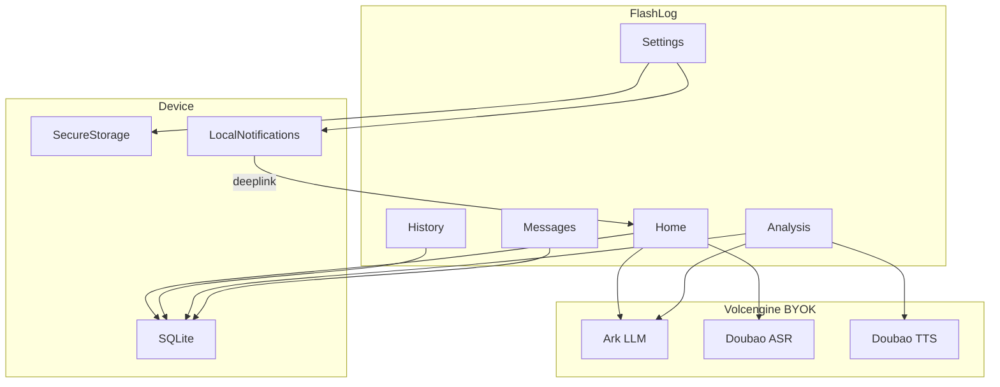

# FlashLog — AI 智能工时记录

> 本地优先 · BYOK · 无后端

FlashLog 是一款纯单机移动端应用：用文字或语音描述工作内容，由大模型提炼为标准「工时卡片」并保存在本机。工时数据不离开设备；LLM、语音识别与语音合成请求由 App **直连用户自行配置的云服务商**（默认火山引擎），不经任何第三方服务器转发。

## 产品原则

| 原则 | 说明 |
|------|------|
| **Local-First** | 工时记录仅存本机 SQLite，支持离线查看与手动录入 |
| **BYOK** | 用户自带 API Key，费用由用户自行承担 |
| **No Backend** | 无账号、无云同步、无 API 代理 |

## 功能概览

### 工作记录

- 文字输入或按住麦克风录音（最长约 3 分钟）
- 火山豆包语音 ASR 转写，支持 WebSocket 录完识别
- 点击「AI 总结」→ 流式输出 → 生成一张可编辑工时卡片
- 卡片字段：任务名称、工时大类、归属日期、预估时长、描述
- 口述「昨天…」等可解析为其他日期；保存前可手动修改
- 补充说明后重新总结会合并覆盖当前预览，确认保存后写入 SQLite

### 消息

- 统计自启用日起、尚未填写工时的**中国工作日**
- 底部 Tab 角标显示待补记天数
- 点击某日跳转工作记录页并聚焦输入框

### 历史

- **列表视图**：按日期倒序浏览近一年记录
- **日历视图**：按月查看有记录的日期
- 单条编辑 / 删除（二次确认）
- 按日期范围**导出与分享**：纯文本、图片、Excel、Word
- Android 支持定向分享至微信、QQ、企业微信

### 分析

- 基于本机工时数据的 AI 对话助手
- 自动从问题中解析时间范围（如「总结这周的工作」）
- 常用问题快捷入口；支持多轮对话
- 可选 TTS 语音播报分析结果（复用 ASR API Key）

### 设置

- **LLM**：火山方舟（OpenAI 兼容），可自定义 Base URL、Model/Endpoint、System Prompt
- **ASR**：火山豆包语音，API Key + Resource ID
- **TTS**：豆包语音合成 2.0，音色与模型可选
- **定时提醒**：工作日或每天固定时间本地通知，点击深链至工作记录
- **工时大类**：自定义分类，AI 总结时自动归类
- **外观**：浅色 / 深色主题
- **清除本地数据**：二次确认，不自动清除 API Key

## 演示视频

真机录屏，展示录音 → AI 总结 → 保存 → 历史 / 分析主流程。

<video src="assets/demo/flashlog-demo.mp4" controls width="360">
  您的浏览器不支持内嵌播放，请<a href="assets/demo/flashlog-demo.mp4">下载视频</a>观看。
</video>

## 架构示意



## 快速开始

### 环境要求

| 项 | 要求 |
|----|------|
| Node.js | LTS 18+ |
| 浏览器开发 | 现代浏览器 + 麦克风（可选） |
| Android 构建 | JDK 17、Android SDK；详见 [ANDROID.md](ANDROID.md) |

### 安装与运行

```bash
npm install
npm run dev          # http://localhost:5173
npm run build        # 生产构建 → dist/
npm run preview      # 预览 dist/
```

**浏览器开发说明**

- 工时数据使用 localStorage 回退（非 SQLite）
- API Key 使用 Preferences 回退（非 Secure Storage）
- ASR WebSocket 经 Vite 代理 `/api/openspeech-ws` 转发至火山

### 首次配置

安装 App 或启动开发服务器后，进入 **设置** 填写凭证：

| 服务 | 必填项 | 默认值 |
|------|--------|--------|
| LLM | API Key、Model / Endpoint ID | Base URL: `https://ark.cn-beijing.volces.com/api/v3` |
| ASR | API Key、Resource ID | `volc.bigasr.sauc.duration` |
| TTS | 复用 ASR Key、Resource ID、音色 | Resource ID: `seed-tts-2.0` |

- LLM Model 可填推理接入点 `ep-xxxxxxxx`，或模型名如 `doubao-1-5-pro-32k-250115`
- 未配置 LLM Key 时，「AI 总结」不可用，但仍可手动填写卡片并保存

**参考文档**

- [火山方舟 OpenAI 兼容 API](https://www.volcengine.com/docs/82379/1330626)
- [大模型流式语音识别](https://www.volcengine.com/docs/6561/1354869?lang=zh)
- [豆包语音合成 HTTP/SSE](https://www.volcengine.com/docs/6561/1329505?lang=zh)

## Android 构建

```bash
npm run android:debug
```

等价于执行 `build-android-debug.bat`：构建前端 → `cap sync` → `gradlew assembleDebug`。

产物路径：

```
android/app/build/outputs/apk/debug/app-debug.apk
```

安装到真机：

```bash
adb install -r android/app/build/outputs/apk/debug/app-debug.apk
```

完整环境配置、Release 签名等见 **[ANDROID.md](ANDROID.md)**。

## 项目结构

```
src/
  pages/          Home, Messages, History, Analysis, Settings
  components/     UI 组件（analysis/、ShareWorklogSheet 等）
  services/       aiService, asrService, ttsService, export/, analysis/, reminderService
  db/             workLogRepository
  stores/         settingsStore, draftStore, pendingStore, analysisChatStore, themeStore
  plugins/        headerWebSocket, targetedShare（Capacitor 桥接 Android 原生）
  constants/      默认配置、分析 Prompt 等
  utils/          日期、工时大类、音频处理等
assets/
  demo/           README 演示视频
android/          Capacitor Android 工程
```

## 技术栈

| 层级 | 选型 |
|------|------|
| UI | React 19 + TypeScript + Tailwind CSS 4 + Lucide React |
| 构建 | Vite 6 |
| 路由 | React Router 7 |
| 状态 | Zustand 5 |
| 壳 | Capacitor 8（`@capacitor/android`） |
| 敏感配置 | `capacitor-secure-storage-plugin` |
| 非敏感配置 | `@capacitor/preferences` |
| 工时数据 | `@capacitor-community/sqlite`（浏览器回退 localStorage） |
| 本地提醒 | `@capacitor/local-notifications` |
| 导出 | `docx`、`xlsx`、`html-to-image` |

**自定义 Android 插件**

- `HeaderWebSocketPlugin` — ASR WebSocket 握手时写入火山鉴权 Header
- `TargetedSharePlugin` — 微信 / QQ / 企业微信定向分享

## 数据模型

```typescript
interface WorkLogItem {
  id: string;                 // UUID
  date: string;               // YYYY-MM-DD，归属工作日
  title: string;              // 任务 / 模块名
  category: string;           // 工时大类 id（来自设置）
  durationMinutes: number;    // 预估工时（分钟）
  description: string;        // 精炼描述
  rawInput: string;           // 当次原始输入（转写 / 打字合并稿）
  supplementHistory?: string[]; // 历次补充说明
  createdAt: number;          // Unix ms
  updatedAt: number;
}
```

## 隐私与安全

- 工时记录仅存本机，不出网
- 网络请求仅发往用户配置的 LLM / ASR / TTS endpoint
- API Key 存 Secure Storage（Android/iOS）；浏览器开发时使用 Preferences
- Settings 页明确提示：第三方 API 调用费用由用户自行承担

## 脚本参考

| 命令 | 说明 |
|------|------|
| `npm run dev` | 本地 Web 开发 |
| `npm run build` | TypeScript 检查 + Vite 构建 |
| `npm run preview` | 预览生产构建 |
| `npm run cap:sync` | build + Capacitor sync |
| `npm run cap:android` | sync + 打开 Android Studio |
| `npm run android:debug` | 一键构建 debug APK |

---

*FlashLog v0.1.0 · Capacitor + React*
